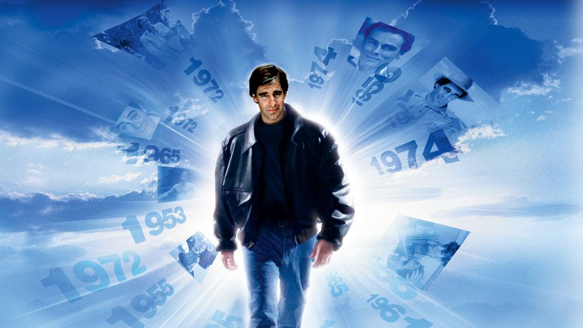

# Your Move

__Written by Hayley Igarashi__

__Published on https://blog.reedsy.com/__

__Genre: Fiction Mystery__

This is a story about a man who wants to kill you. I have my doubts, not about the man or about the story, but about you. I fear I do all this for nothing.

Listen: I would scream if I had a mouth. I have a story. So that is what I will use.

You have seen him before. He might as well live in your periphery. He is tall and seems to carry his weight in his chest and shoulders. He has a narrow waist and legs that taper down to small leather shoes.

Not that you've noticed any of this before. You've been distracted, haven't you? If I told you this same man walked by your home every day, paused to peer into your window, you wouldn't believe me. But you couldn't say for certain that I'm wrong.

I'm not wrong.

He might be very close right now. He might even be in your house. After all, there are so many excellent hiding places, aren't there? The back of a closet, behind the shower curtain, inside a cabinet...

But I'm getting ahead of myself. I promised you a story. And perhaps we still have time for it.

Understand : This man is not from your time. Spare me your disbelief. There are things beyond your comprehension. You are too old to think you know the universe.

Twenty years from now, this man lives on the coast with his five-year-old daughter. Their house, a patchwork creation of driftwood and corrugated metal, clings to the side of a rocky cliff. When the tide crashes in, the salt spray splashes against the windows. The sky's the color of steel, and the water is a foam-flecked black.

Everything is cold , harsh, and wet-except for inside the house. Warm yellow light spills out from a window, and a steady finger of smoke curls up from a slanted chimney.

Inside, the man reads to his daughter. He sits in a faded orange armchair by the fire, and she lays on her stomach in front of him, alternating her focus on the flames and the pages turning in her father's hands.

"When you finish this story, can you read another?"

He makes a show of looking at half the book that's still remaining and then looking back at her. "Already tired of this one?" She shakes her head. "No, I don't just want this one to be over. I don't want them to ever end."

He smiles and agrees, even though he knows she'll be asleep long before he'll have to pick out a new book. He knows how she feels. He doesn't want any of this to be over. He wants to hold onto every second, close his fingers around them and keep them safe, keep them from marching on.

And it is at that moment that everything goes white...a blast of blinding light that disintegrates the scene into dust, and then fades.

When the man comes to, he is wedged into the cliff's face, soaked, hanging a few feet above the waves. Above him, the remains of his house: a couple stumpy wooden beams and one amputated orange limb of his armchair. Below him, an inky black ocean.

His daughter is gone. He will search for her for a long, long time.

What he finally finds is not what he is looking for. He discovers a way to go back. But innovation is never as neat as any of us would like. He can only travel back a set number of years, way before his daughter is born.

So before he goes back, he does his homework. He researches. He spends hours in the archives of war museums, flipping through files, searching for someone new.

Searching for you.

And then he makes a leap, jumps back a few decades, emerges the same, if a little nauseous for a spell, into a world transformed. The colors seem brighter here, the smiles wider, flashing ferociously, the eyes emptier and hungrier.

But of course that's what he would see. Him, an interloper. Here, a brave old world.

On his third day back, he finds you, speaks to you. He asks you for the time. His hands are trembling; his eyes never leave yours. Do you remember? It was a year or so ago.

Your paths keep crossing, but he gets more cautious, becomes a flickering shadow, in and out of the corners of your life. Waiting. Watching.

So where is he now? Soon you might know better than me.

He is tightening his resolve now, like a noose.

Listen: You killed this man's daughter. Not yet, not now. Twenty years in the future. Will it make you feel better if I say it was for a "cause"? Or for the "'greater good"? It's true. At least it's true that you'll tell yourself that when the time comes.

I understand you are not a killer. Neither is this man with wide shoulders and tiny shoes who may be in your house right now. But the years change us. Stories change us. You will be protecting your family, your friends, when you send bombs across the sea. And he thinks, by killing you, he'll be avenging the memory of his daughter.

Maybe you still don't believe me. But think: Is there a limit to what you would do for love? is there any price too high to pay? You will have an answer for that soon, in the trying years ahead, whether you can face it now or not.

You two are very similar. Do you find that interesting? Relevant? Perhaps not. You both love words and tales and drama, mystery, and madness of being alive.

See: His story is partly your story, too.

But no more of this. I fear it may be too late, and I've done all I can. Please, listen.

Not to me.

A sound. Can you hear it? It's inside your home. Maybe the creak of a door or a soft muffled step on the carpet. Or a shallow inhale of breath that's not yours...

He is there, right now. Do not run. Do not call for help.

Remember the story. He doesn't want this one to end, not like this-and not deep down, not where it counts. Do you?

The shadow in the corner, It's not a shadow.

Okay. Your move.

# Medusa

__Written by Douglas Richards__

__Published on https://www.storystar.com/__

__Genre: Fiction Drama__

Henry bit his lip to quiet his growing unease. Doris' late afternoon walk seemed longer than usual. Streetlights had just switched on. Probably met a neighbour on her jaunt and got to talking. Doris loved to talk.

Still.

"I think the new people on Splinter are making Medusa," she'd told him last night.

She'd sat in her rocking chair in the living room, moving slightly, and continued to knit, wooden needles moving expertly in her skilled hands. Even with arthritis, she refused to give up her hobby.

"Why do you say that?" he'd asked, already suspecting her answer.

"A feeling."

Doris and her feelings, he thought as he wrung his hands together, pacing the living room. He seldom doubted her when it came to feelings. It's what had once made her an exceptional journalist.

Ever since the heart attack two years before, Henry tired easily. He finally sat down on the edge of the recliner, but he could hardly relax. He stared at the silent tv news while his fingers played a staccato on the leather arm. The banner below the on-screen talent scrolled only more depressing news. Gun violence, explosions, uprisings, hospitals filled to capacity, millions dead...all due to Medusa.

Medusa. Medusa. Always Medusa.

Quick, he left the chair, and found himself at the front window yet again. He shifted them to once stare up both sides of the street. He longed for her to round the corner. Not for the first time, he checked the clock on the entertainment stand. She was an hour late, almost.

As he again tried to call her, his eyes swung to her rocking chair. He glanced down at the basket parked by the runners, needles poking out from a pile of blue and green yarn. Just where she'd left them last night. She liked knitting at night, she always said it calmed her mind.

Closing his eyes for a second, he could almost imagine her sitting there, the soft click of needles rubbing together, her voice as she spoke, the often-subtle squeak of the chair's runners as she rocked.

Voicemail again. Damn!

"A lot of sketchy people in and out of that place is all I know," she continued. "They look like drug addicts."

Henry knew all too well what Medusa did to people. How it eventually hollowed out the face as well as your soul. You could tell frequent users.

"Walk the other way," he told her. "I mean it."

"Of course, dear. Medusa right there in little old Napanee. Can you believe that? Makes a hell of a story."

"For someone," he said, more gruffly than he intended.

He could believe anything in this messed up world. Enough looking out of the window. He'd go look for her. She might give him shit for worrying. Of course, I'm fine, she'd say. I'm always fine. Did she ever slow down? He often wondered if she ever would. If she did, he expected that wouldn't be the woman he'd fallen in love with over 51 years ago.

"Medusa right here in Napanee."

The Medusa name made him cringe as he slowly shrugged on a jacket. Not only was it a highly addictive drug, offering users feelings of absolute euphoria, it's side effect was that some experienced in increasing numbers, the ability to read the minds of others just by looking in their eyes. Hence ‘Medusa’ name... the woman whose stare could turn mortals to stone. The war on this drug quickly swept the planet, vicious and unforgiving, banned by all countries, but still it couldn't be contained and became the worldwide epidemic it was today.

He zipped up his jacket, opened the front door and paused. A slow-moving vehicle pulled onto their street, headlights washing the road before it. Apprehension filled him. He moved to stand on the front stoop, a slight breeze ruffled his thinning grey hair.

The white van knocked up against the curb in front of their home and just sat there. After a minute, the driver's door opened and a large, linebacker of a man climbed out. He slammed the door and stared right at him.

"Henry?"

He barely nodded.

"Good evening", he said.

Henry's heart started to race. "I'm going to look for my wife", he said.

"That's why I'm here. She's had an accident, I'm afraid."

Accident? He shoved his hands deep in his jacket pockets and made fists while he trembled.

"Who are you? What have you...?"

"I'm the guy who found your nosy-nosy wife. I caught her looking in my basement window if you can believe that."

Doris was gone. The thought hit him hard. It was surreal to think of his wife gone. But he suddenly sensed it. Maybe he had sensed it all night.

An empty rocking chair where she would no longer sit filled his mind and filled him with rage. Quickly, he pulled a cell phone from his pocket. "I'm calling the police."

"I'm blocking the signal." At this the linebacker gave two quick raps on his driver's side door. "Isn't tech wonderful? You should see the toys I got inside."

Henry looked down at his phone. No bars. The man made no move to approach him as Henry glanced both ways down the street. "I came alone in case you're wondering. I take care of my own shit." 

With that, the man did take a step onto the paved drive. "Stay there," Henry warned. "I just want to talk, that's all." Henry took a step back .

"I popped an M and dug deep into her mind, Pops", he said. "That's how I knew where to find you. She told you about our little house, huh?"

"I don't know where it is."

"You have an idea."

"No closer!"

We'll just have to talk, you and I."

Henry returned to the house. He slammed the door behind him and bolted it. As he took steps back, he watched through the side panels of the frosted glass. The man stood there, a smudge that soon drifted away.

The garage!

Henry spun to head there. He had no doubt the side door in the garage would be open. He never locked it. But the door that led from garage to house? Even as he started there, he heard the quick turning of a locked door. He'd locked it. Thank God!

He jumped at the loud crash, the splitting of wood. The door had been kicked in.

Quickly, he grabbed a kitchen knife off the kitchen counter and shoved it up his sleeve, letting his hand cup the hilt. The man's heavy footsteps approached. He peeked cautiously around the corner into the kitchen.

"There you are!"

Henry backed up toward the living room. 

"Get out of my home." 

"But we haven't had our chat yet."

Henry whipped out the knife and lunged. Younger and faster, the large man grabbed his wrist quickly and squeezed tight. Wincing in pain, Henry's fingers opened reluctantly, and he dropped the knife.

The man then pushed him away and Henry stumbled back, tripping over the rocker's skids.

The hulking figure crouched down next to him as Henry struggled to sit up, kitchen knife in hand. Beneath his jacket, Henry spied a gun. Maybe he could go for it.

"She was a fighter, your wife."

"You didn't have to kill her!" He fought back a wellspring of emotions that threatened to drown him.

"But, oh...what a rush it was when I did, when I scooped out everything she ever was. I tore her memories to shreds. She couldn't stop screaming, man, and begging, just begging me to stop."

His fingers curled into a fist, but in that fist he only felt softness. He glanced down and saw blue and green yarn looped around his fingers. He must have kicked the basket when he fell.

Doris was still very much here, he realized.

"The police will wonder what happened to us", he said, focusing his gaze on the man who'd killed his wife-And the gun.

"The police are useless", he spat, then opened his left palm to reveal a large yellow pill with the big M on it. Henry had seen them on tv.

He popped it in his mouth and swallowed it. And while his eyes closed...Henry rammed a wooden knitting needle through his eyelid, through his eye and into his brain.

The hulk stood up fast, then a silent scream caught his lips. He stumbled two shaky steps before pitching forward, driving the needle further into his brain. The body spasmed once, twice before becoming still.

Henry has once been a stone mason. His hands were still the strongest things about him. Within minutes, Henry slipped out to the truck and slowly turned it around and headed to the house on Splinter. He pulled a stop half a block away and immediately spotted the house and two men on the front porch smoking. Had Doris gotten past them? She was always resourceful.

He smiled and opened his hand.

Quick, he popped the pill he'd gotten from the pocket of his attacker. Swallowing it, he felt the effect almost immediately. The warmth spread through him and he could almost feel the synapses in his brain firing like a machine gun. It made him feel young, so young, like he could do anything.

Maybe he could.

As he left the van, he held the gun down at his side, and started the walk, a spring in his step and death on his mind.

The end.

